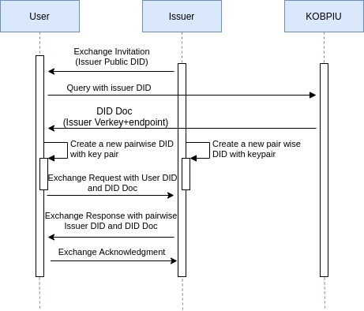

# KOBPIU

| Title | KOBPIU |
| :---: | :---: |
| Version | TBD |

## Abstract

KochiOrgBook Public Identity Utility is an identity network for the city of Kochi. All the DIDs will be hosted upon this identity network. This network constitutes the 1st layer of [ToIP technology stack](images/ToIp.png). This first layer contains the DIDs of various citizens and organizations/associations within the city of Kochi. The identity utility network is similar to that of Sovrin network.

## Dependent Projects
Hyperledger Indy
## Motivation

Individuals and organizations use variety of credentials and documents over the internet for various purposes and these credentials and documents serve as unique identifiers which contains communication address, ID Numbers and other personal information. Sharing these personalized information in the Internet can cause security issues as well as it requires more time and effort. 
## Status of the project

Incubation state.

## Solution
In the current situation, proving your identity requires more time and effort. There are a lot of security challenges too. KOB Public Identity Utility acts as a network layer in which the citizens as well as the organizations or associations within the city of Kochi can host their verifiable credentials and perform different transactions within the network. This can be used to prove one's identity and eligibility whenever required. Any associations and digital service provider within the city of Kochi can participate in this network. These identities are independent of any central authority, the participants can control it themselves. This network is associated with a DID Root Namespace that operates under its own Governance Framework. Hyperledger Indy provides tools and libraries to create this digital identity rooted on blockchains that are interoperable across the  city of Kochi.
## Usecase
### Create DIDs using PIU

### Manage DIDs using PIU

## Contributors
[Anjana M P](https://github.com/Anjana-mp)

## Testing the project

TBD

## References
* [Edx-course](https://www.edx.org/professional-certificate/linuxfoundationx-developing-blockchain-based-identity-applications)
* [Decentralized Identifiers](www.w3.org/TR/did-core)
